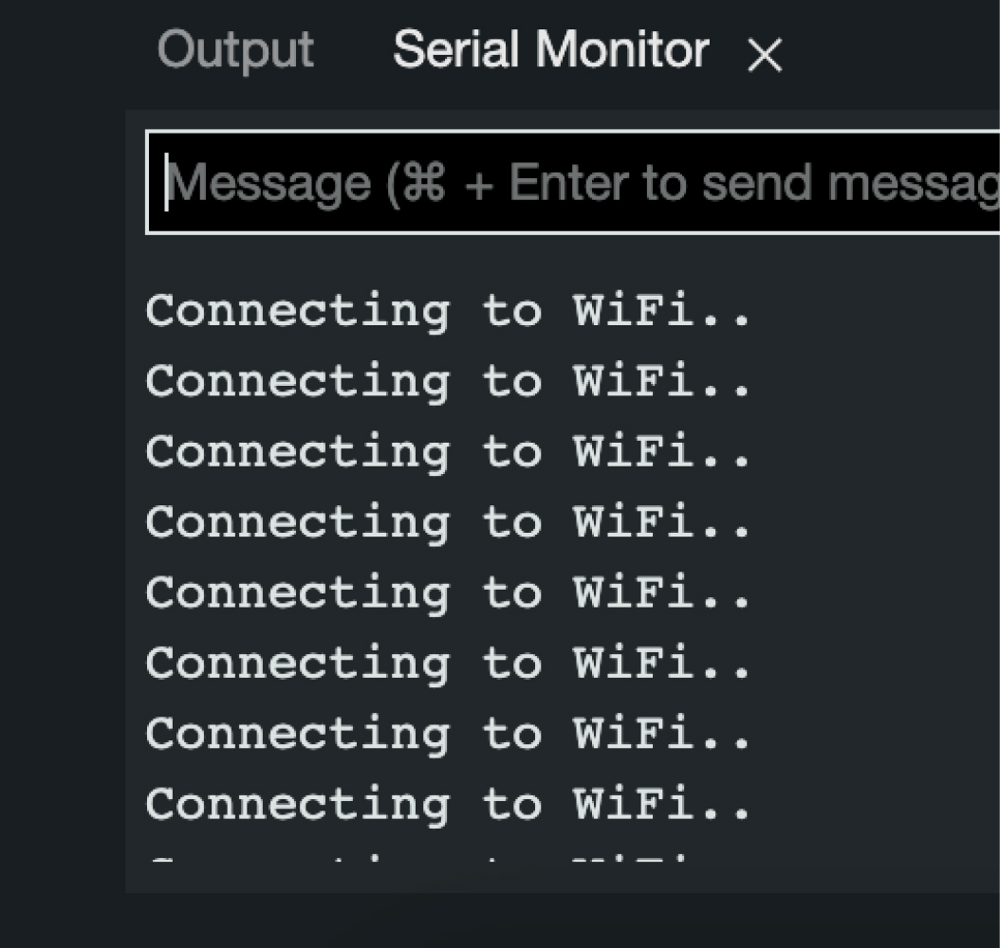
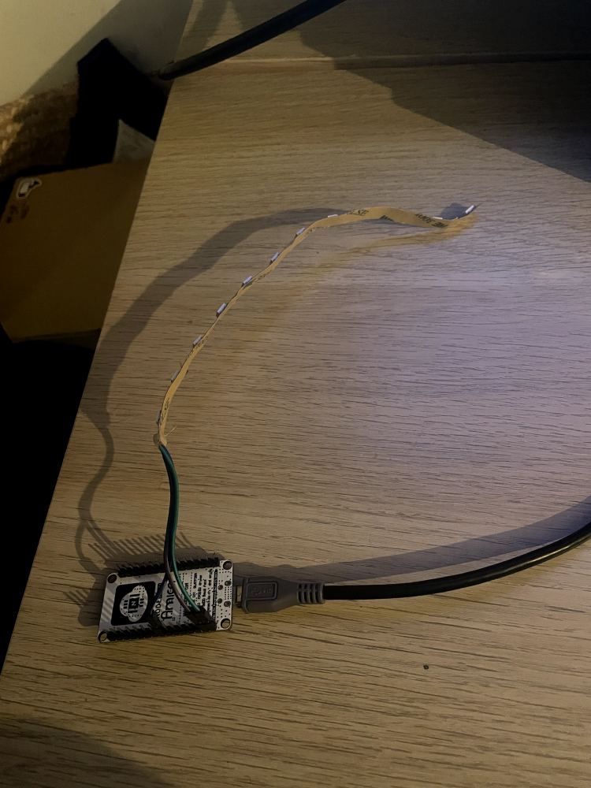
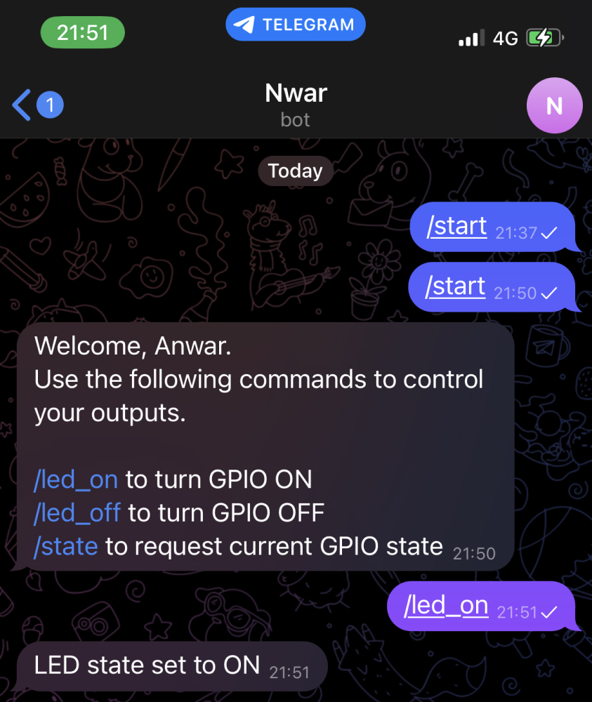
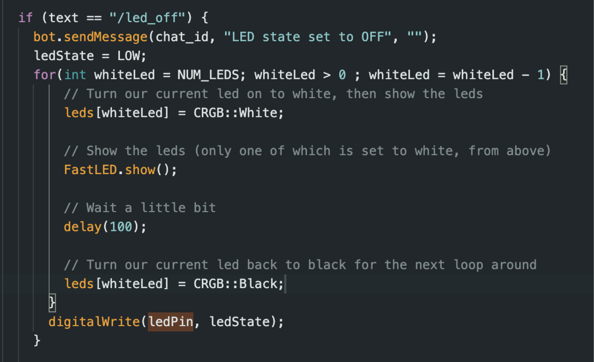
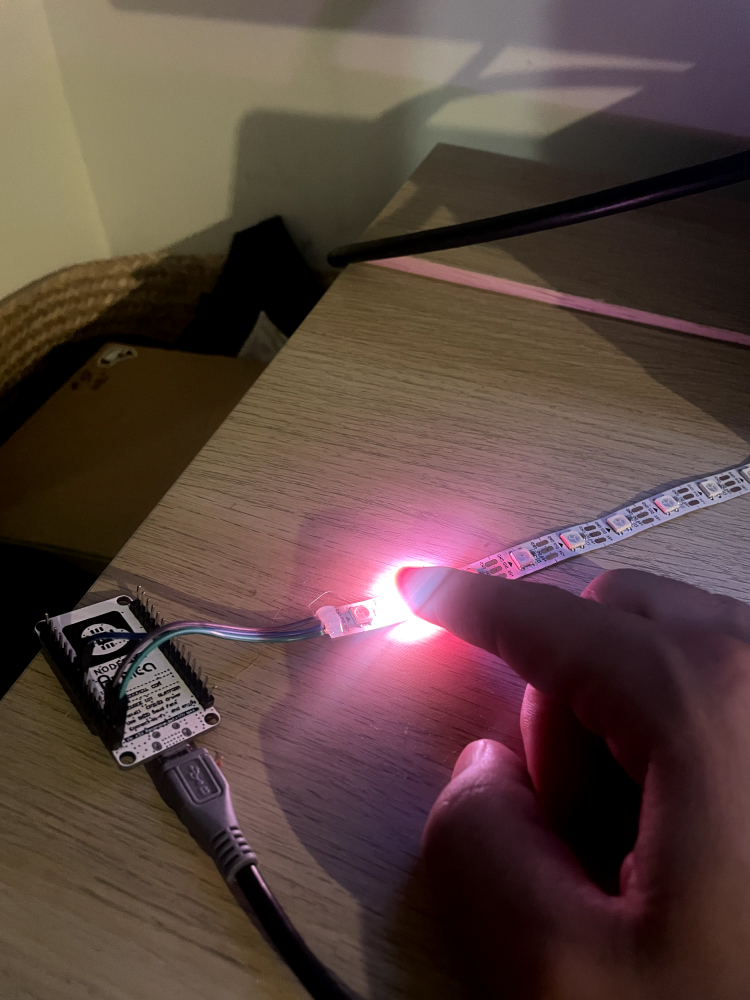

# Manual Telegram - Arduino

I wanted to create a bot on Telegram that will turn the light on and off if I send a message. I found a tutorial on randomnerdtutorials.com that’s gonna help me to make this happen.

## Create a bot

To create a bot I had to search BotFather in the search bar in Telegram. I pressed the start button and followed the prompts that were given to me. My bot is called Nwar because it means light in my language and my name is Anwar.

## Setup User ID.

In order that other people can't use my bot I want the ESP check if the bot is being activated with only me. I could do that by finding my telegram user ID and Pasting it in the ‘CHAT_ID’ variable in the code. I tried to find the ‘idbot’ in the search bar in Telegram but I couldn’t find it. But luckily I could also follow this link: t.me/myidbot. When I checked again in the search bar there was a button “show more” to reveal more people and it was on the 6th spot.  

## Wifi fix

I added the code from randomnerdtutorials.com and changed all the variables so they would correspond with the pins en wifi I use. When I pushed the code the Serial Monitor showed me the message ‘Connecting to Wifi’ but could connect. I tried to look online for the answer and found a question in Stackoverflow about connecting the NodeMCY to an Iphone Hotspot. The top answer was saying to change the Wifi.mode to ‘WIFI_STA’ but in the code this was already stated. The person also stated in the answer that there are other modes. I tried to change it to ‘WIFI_AP_STA’ just to see if it would work. It didn’t. Then I put my hotspot off and on and for some reason it worked. I tried to change the mode back to ‘WIFI_STA’. That worked as well. I think to connect your NodeMCU You first need to push the code and then turn your hotspot off and on to connect. 

## Turning on the Light

I sent the message ‘/start’ and then ‘/led_on’ and the bot replied back with ‘Led state set to ON’. The serial Monitor showed me the message came true but the Led wasn’t On. I think this is because I use a Led Strip and not a single Led. 

## FastLight Library

Before this exercise I used the FastLed Library to work with the ledstrip. I added the Library to the project by including it on the top. I assigned the number of the Leds and pasted the for loop in the code when it received a new message of ‘/led_on’ via the bot. When I pushed the code and sent the message via the bot, nothing happened. I found an article about using leds with the nodeMCU and I saw that I forgot to initial FastLed in the setup. And after that it worked. When I tell the bot ‘/led_on’ the light turns one by one on and off and the last LED stays on.

## Turning off the Light

In order to turn the light off I wanted to make the loop revert from the top light going on and off to the bottom. I did that by using this code but it didn’t work. The second from the bottom light was on and it had to go 2 more steps. That’s why instead of ‘whiteLed > 0’  I did ‘whiteLed > -2 ‘ so it will go 2 more steps. Everything works now!!

# IOTRepo

  
Resources

1. https://randomnerdtutorials.com/telegram-control-esp32-esp8266-nodemcu-outputs/
2. https://stackoverflow.com/questions/43354086/nodemcu-esp8266-connecting-to-iphone-hotspot-with-c
3. https://how2electronics.com/ws2812b-neopixel-led-strip-nodemcu/

